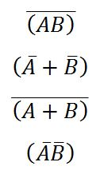
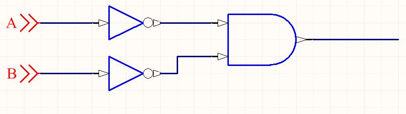
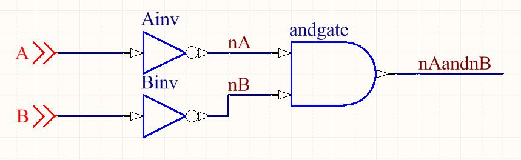

# HW 0b001: Verilog Tools and DeMorgan's Law

To be completed in class (due before Monday class)

## Install tools
For this assignment you will need the [Icarus Verilog](http://iverilog.icarus.com/) simulator (`iverilog`). If you are using the provided virtual machine, this (along with several other tools you'll need later in the class) is pre-installed. Otherwise, install it for your platform.

## Hello, Verilog!

In your favorite text editor, create a file named `hello.v` with the following contents:

```verilog
// Simple Verilog test
module hello_test ();
initial begin
    $display("Hello, CompArch!");
end
endmodule
```

We can run the test through `iverilog` with the following commands:

```
iverilog -o hello hello.v
./hello
```

`iverilog` actually creates an executable program based on your Verilog (here, `hello`), which you then run to see the simulation results. If you do not specify `-o <foo>`, the executable will be called `a.out` just like for a C compiler.

## Your first Verilog

Prove DeMorgan’s Law using the exhaustive proof method.  To do so, you will use Verilog to create truth tables for the following 4 equations:



### Schematic capture
First, draw a schematic of each of the four equations (on paper is fine).  To help you get started, here is one for `(~A)*(~B)`:



Then, give each gate and each wire a name. `A` and `B` are already named.



### Translate to Verilog
Each element becomes a line of Verilog.  Create a new Verilog file called `hw1.v` to contain your module. Here is the schematic above, captured:

```verilog
module demorgan
(
  input  A,          // Single bit inputs
  input  B,
  output nA,         // Output intermediate complemented inputs
  output nB,
  output nAandnB     // Single bit output, (~A)*(~B)
);

  wire nA;
  wire nB;
  not Ainv(nA, A);  	// Top inverter is named Ainv, takes signal A as input and produces signal nA
  not Binv(nB, B);
  and andgate(nAandnB, nA, nB); 	// AND gate produces nAandnB from nA and nB

endmodule
```

### Create a testbench
The statements above show the structure of the module. We still need to add some stimuli to drive the module for testing. We will write this test code within an Verilog `initial` block.  You could put the test code within the module we wrote previously, but it is better practice to separate circuits and their tests.

Create a new file called `hw1.t.v` with the following contents:

```verilog
`include "hw1.v"

module demorgan_test ();

  // Instantiate device/module under test
  reg A, B;                // Primary test inputs
  wire nA, nB, nAandnB;    // Test outputs

  demorgan dut(A, B, nA, nB, nAandnB);  // Module to be tested


  // Run sequence of test stimuli
  initial begin
    $display("A B | ~A ~B | ~A~B ");            // Prints header for truth table
    A=0;B=0; #1                                 // Set A and B, wait for update (#1)
    $display("%b %b |  %b  %b |    %b  ", A,B, nA, nB, nAandnB);
    A=0;B=1; #1                                 // Set A and B, wait for new update
    $display("%b %b |  %b  %b |    %b  ", A,B, nA, nB, nAandnB);
    A=1;B=0; #1
    $display("%b %b |  %b  %b |    %b  ", A,B, nA, nB, nAandnB);
    A=1;B=1; #1
    $display("%b %b |  %b  %b |    %b  ", A,B, nA, nB, nAandnB);
  end
endmodule    // End demorgan_test
```

When you use `iverilog` to run `hw1.t.v`, you should see the following output:

```
A B | ~A ~B | ~A~B 
0 0 |  1  1 |    1  
0 1 |  1  0 |    0  
1 0 |  0  1 |    0  
1 1 |  0  0 |    0  
```

### Add the other 3 equations
Continue in the manner described above to create the remaining three equations. Your final result should exhaustively prove DeMorgan's Laws.


## Submission
Create a plain text `results.txt` file containing your completed  truth table. Push results.txt to your Github in the HW1 folder. There is no write-up or other deliverable.

## Tips and Tricks
 - If a signal shows up as “z”, it means it is not being driven.  Are you sure you wired it?
 - The `$display` syntax is similar to what you might find in a `printf` style args function.  The first input is a format string.  `%b` means "interpret the next argument as a bit and display it here".
 - `begin` and `end` are the equivalent of `{` and `}` in C.
